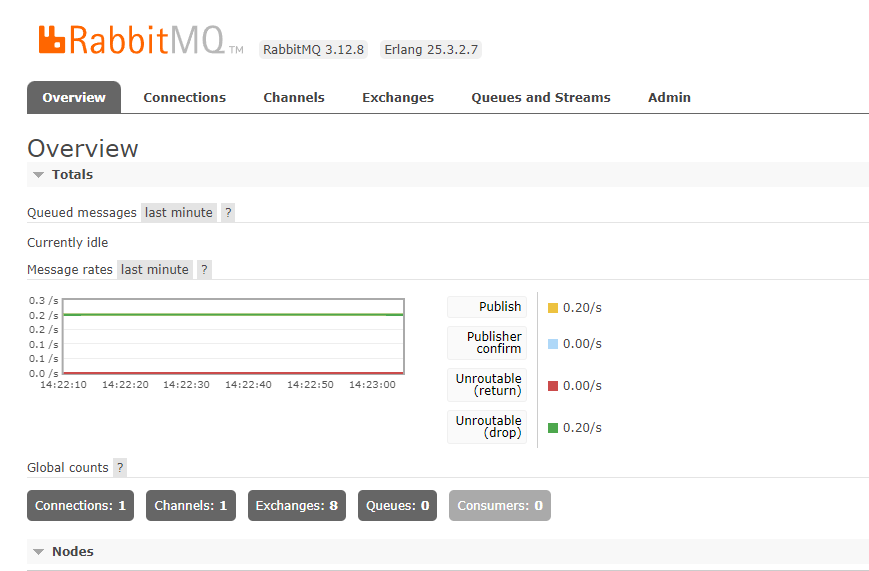
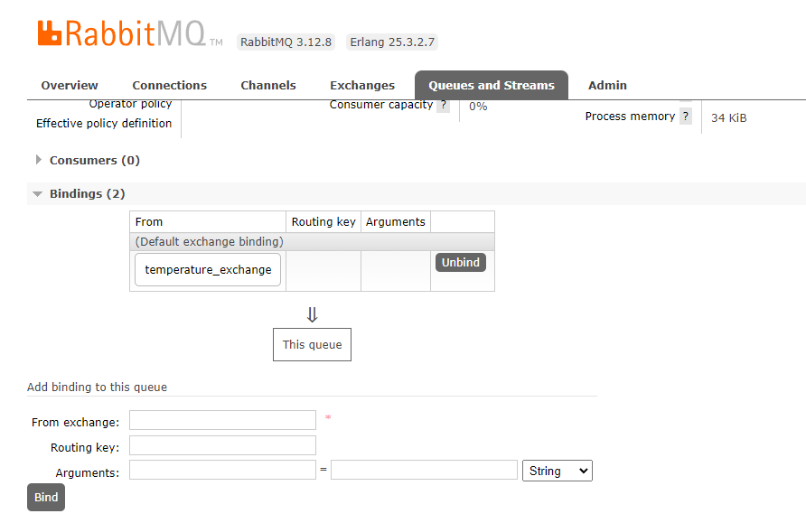
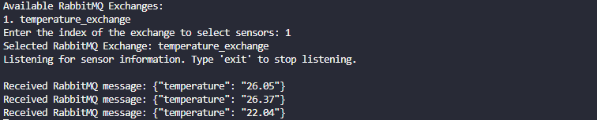

# Ambiente Inteligente T2 (Sistemas Distribuídos 2023.2)

## Descrição do Projeto

Este projeto tem como objetivo simular um ambiente inteligente utilizando as ferramentas/frameworks RabbitMQ e gRPC.

## Funcionamento

O ambiente inteligente simulado é composto por sensores, que coletam dados do ambiente, e atuadores, que podem agir no ambiente para modificá-lo de alguma forma. A comunicação entre os sensores e atuadores é realizada através das ferramentas/frameworks RabbitMQ e gRPC.

Além disso, o Home Assistant atua como um servidor para uma aplicação cliente que possibilita interações do usuário com o ambiente inteligente. Através desta aplicação, o usuário pode receber as informações de momento do ambiente.

## Tecnologias Utilizadas

- RabbitMQ
- gRPC
- Python

## gRPC

O gRPC é um framework de comunicação remota que utiliza o protocolo HTTP/2 para realizar chamadas de procedimento remoto (RPC - Remote Procedure Call) de maneira eficiente entre clientes e servidores. É usado neste projeto para facilitar a comunicação entre os diferentes componentes do ambiente inteligente.

### Atuadores (Funcionamento)
Para controlar um atuador de forma eficaz utilizamos uma abordagem prática que consiste em configurar os atuadores para funcionarem como servidores, utilizando o Home Assistant como um intermediário para gerenciar seus estados. O gRPC desempenha um papel significativo nesse cenário ao facilitar a comunicação como um middleware confiável, garantindo uma troca de dados eficiente e segura entre os dispositivos.

## Rabbitmq 

O RabbitMQ é um software de mensageria open-source que implementa o protocolo Advanced Message Queuing Protocol (AMQP). Ele é utilizado para enviar e receber mensagens entre processos, sistemas e aplicações distribuídas. O RabbitMQ é altamente escalável e pode ser utilizado em diversas aplicações, desde sistemas simples até sistemas complexos e críticos.

### Instalação
Para utilizar o RabbitMQ em um container Docker, siga os seguintes passos:

1. Certifique-se de que o Docker está instalado em seu sistema operacional. Caso não esteja, siga as instruções de instalação no site oficial: https://www.docker.com/products/docker-desktop/
2. Abra um terminal de comandos e execute o seguinte comando:

```
docker run -it --rm --name rabbitmq -p 5672:5672 -p 15672:15672 rabbitmq:3.12-management
```
Este comando irá baixar e executar a imagem do RabbitMQ com a versão 3.12 e o plugin de gerenciamento habilitado. Ele também irá expor as portas 5672 e 15672, que são utilizadas para a comunicação com o RabbitMQ e para acessar a interface de gerenciamento, respectivamente.

Após a execução do comando, o RabbitMQ estará pronto para ser utilizado em um ambiente de desenvolvimento.

Para usar o RabbitMQ em projetos Python, instale a biblioteca pika com o comando:

```
pip install pika
```

### Utilizando o RabbitMQ para ler os sensores
Neste projeto, contamos com três sensores simulados que, por meio de um publisher, enviam mensagens para seus respectivos exchanges. Esses exchanges, por sua vez, direcionam os dados para filas (queues) específicas. As mensagens são posteriormente recebidas e encaminhadas para o Home Assistant, que tem os exchanges previamente cadastrados. Essa configuração permite ao usuário escolher quais dados deseja receber ou não, proporcionando maior flexibilidade e controle sobre as informações provenientes dos sensores simulados.

Para visualizar os valores dos sensores, execute um dos arquivos .py localizados na pasta /sensors. No exemplo abaixo, utilizamos temp_rabbit.py:
```
cd src/sensors
python temp_rabbit.py
```
Simultaneamente, acesse [localhost:15672](http://localhost:15672/) para realizar as configurações finais antes de iniciar o Home Assistant. Para autenticação na plataforma, utilize as seguintes credenciais:

1. Login: guest
2. Senha: guest
A imagem abaixo fornece uma visão geral do processo:



Vá para a seção **Queues and Streams**.

Em **Add a new queue**, no campo "Name", insira **data_queue** e clique em **Add queue**.

Com a sua nova fila criada, clique em **data_queue**. Em "Bindings", adicione no campo **From exchange** o valor **temperature_exchange** e clique em **Bind**.



Repita os passos anteriores para os demais sensores, mas desta vez, ao criar as exchanges, utilize os seguintes nomes:

1. Sensor de Umidade: Utilize o nome da exchange como **humidity_exchange**.
2. Sensor de Pressão: Utilize o nome da exchange como **pressure_exchange**.
   
Siga o mesmo processo descrito anteriormente para criar as filas correspondentes, fazer as ligações (bindings) necessárias e configurar as trocas de mensagens para os sensores de umidade e pressão. Isso garantirá que cada sensor tenha suas próprias configurações no sistema de mensagens.

Por fim execute o Home Assistant
```
cd src
python home_assitant.py
```
Para visualizar os dados, utilize os seguintes comandos:

```
# Para adicionar a exchange do Sensor de Temperatura
add_exchange

# Nome da exchange do sensor
temperature_exchange

# Para selecionar o sensor
select_sensors

# Número do sensor cadastrado
1
```
Se os passos anteriores foram executados corretamente você receberá o output abaixo:



Os valores de saída foram convertidos de bytes para String
